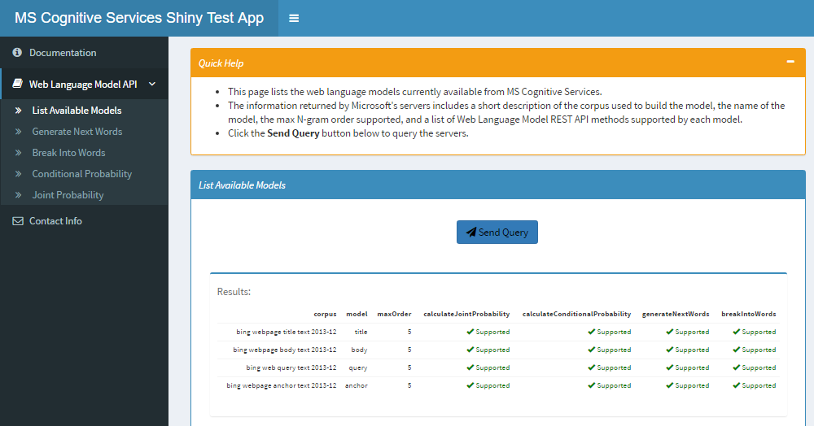
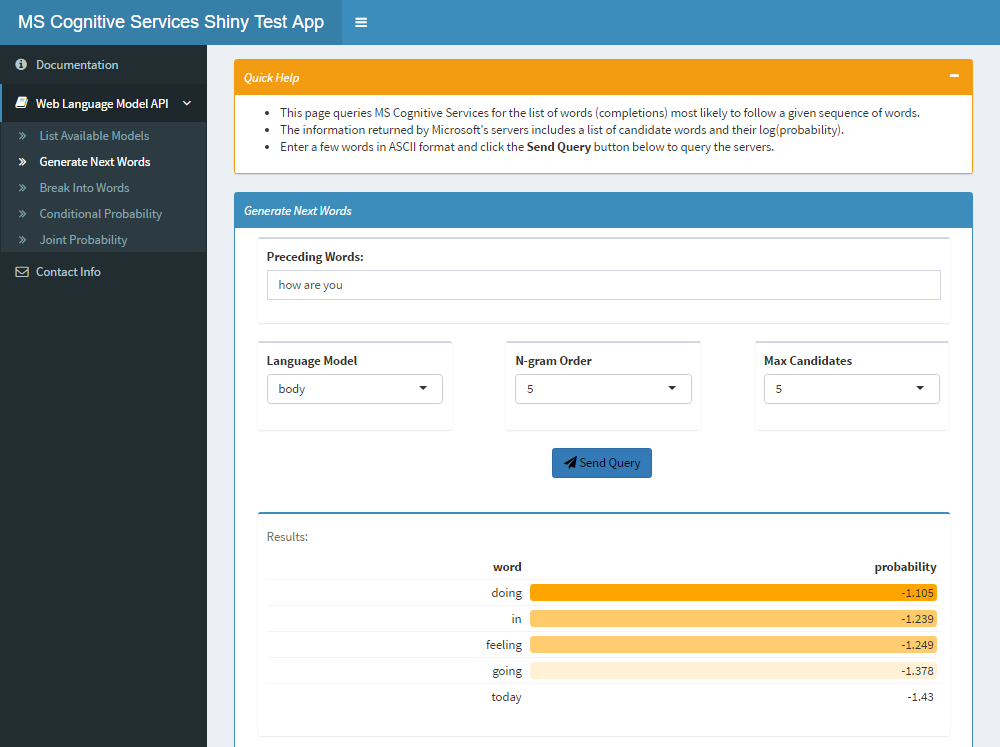
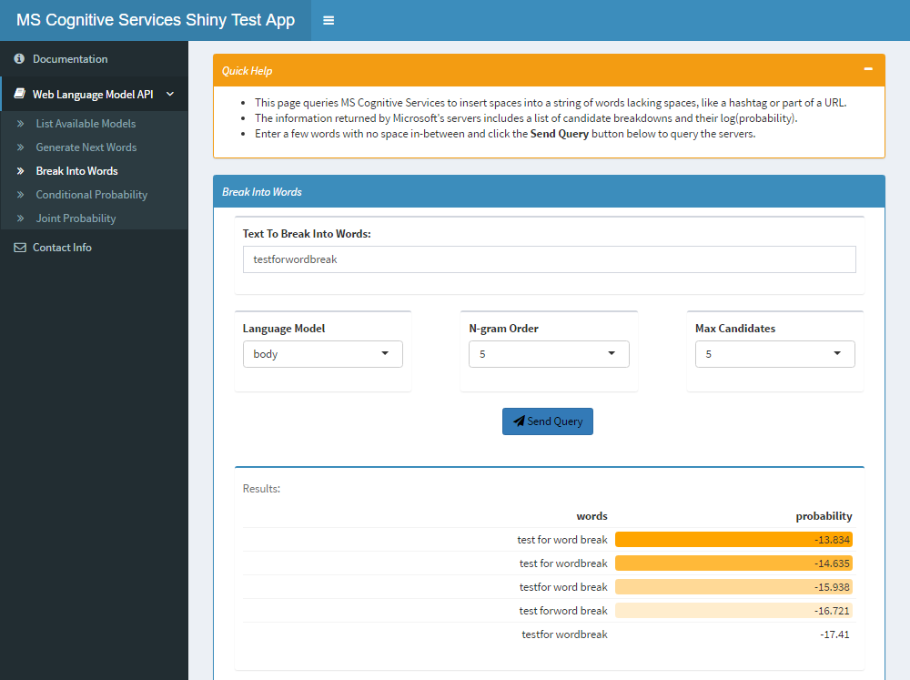
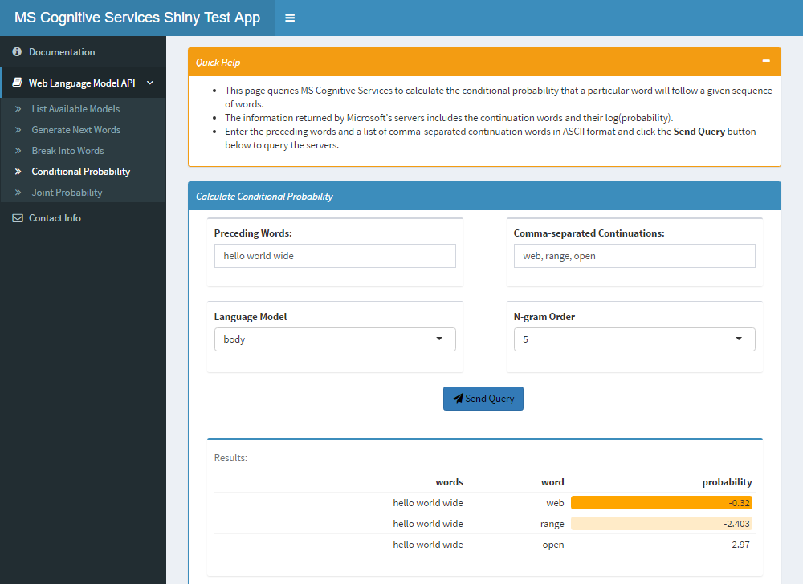
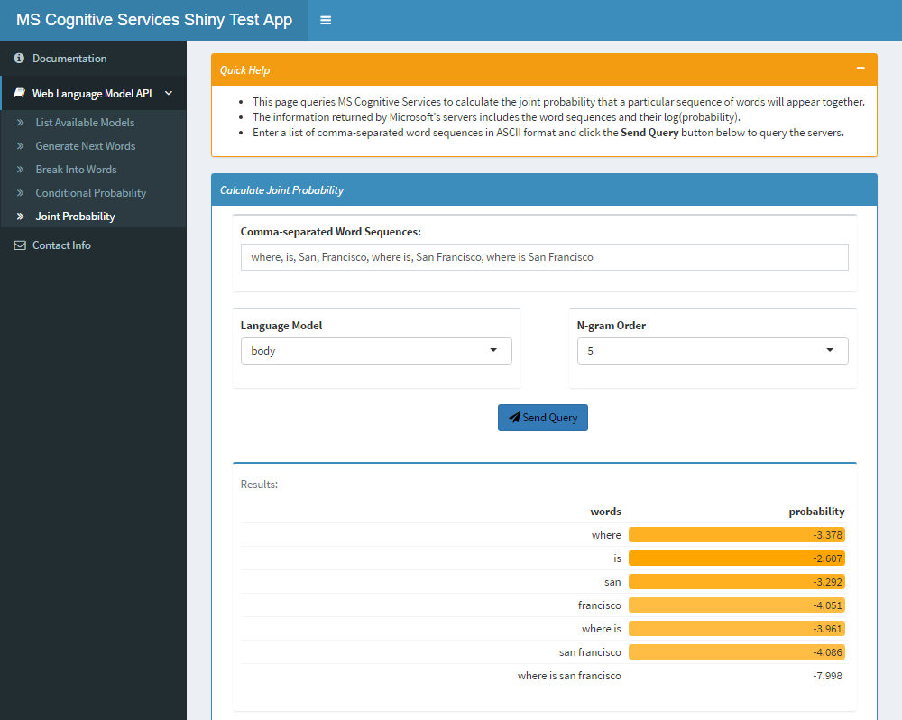

Welcome to MSCSShiny!
=======================

**MSCSShiny** is a test/demo application for R packages like `{mscsweblm4r}` that interface with the Microsoft Cognitive Services REST APIs.

## Microsoft Cognitive Services? What's that about?

[Microsoft Cognitive Services](https://www.microsoft.com/cognitive-services/en-us/documentation)
-- formerly known as Project Oxford -- are a set of large, diverse, truly awesome APIs, SDKs and services that developers can use to add [AI](https://en.wikipedia.org/wiki/Artificial_intelligence) features to their apps. Those features include emotion and video detection; facial, speech and vision recognition; and speech and language understanding.

## MSCS > Language Services

Our interest, at this stage, is limited to the exploration and evaluation of the Natural Language Processing (NLP) features of MSCS:

As should be clear from the above, the NLP subset itself isn't exactly small...

## Language Services > Web Language Model API

To begin our exploration, we've created the `{mscsweblm4r}` R package that wraps the Web Language Model REST API. Per Microsoft's website, this API uses smoothed backoff N-gram language models (supporting Markov order up to 5) that were trained on four web-scale American English corpora collected by Bing (web page body, title, anchor and query). The MSCS Web LM REST API supports four lookup operations:

* Joint (log10) probability of a sequence of words.
* Conditional (log10) probability of one word given a sequence of preceding words.
* List of words (completions) most likely to follow a given sequence of words.
* Word breaking of strings that contain no spaces.

## The `{mscsweblm4r}` package

For more information about the `{mscsweblm4r}` package, please visit the package's pages on [CRAN](https://cran.r-project.org/package=mscsweblm4r), or on [GitHub](https://github.com/philferriere/mscsweblm4r).

## MSCSShiny Screenshots

### Retrieve a list of supported web language models

### Get the words most likely to follow a sequence of words

### Break a string of concatenated words into individual words

### Calculate the conditional probability that a particular word will follow a given sequence of words

### Calculate the joint probability that a particular sequence of words will appear together

## Credits

All Microsoft Cognitive Services components are Copyright © Microsoft.

## Meta

Please report any issues or bugs [here](https://github.com/philferriere/mscsshiny/issues).

License: MIT + [file](./LICENSE)

This project is released with a [Contributor Code of Conduct](./CONDUCT.md). By
 participating in this project, you agree to abide by its terms.

